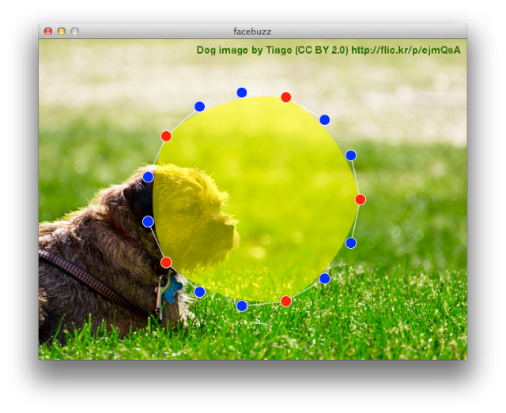
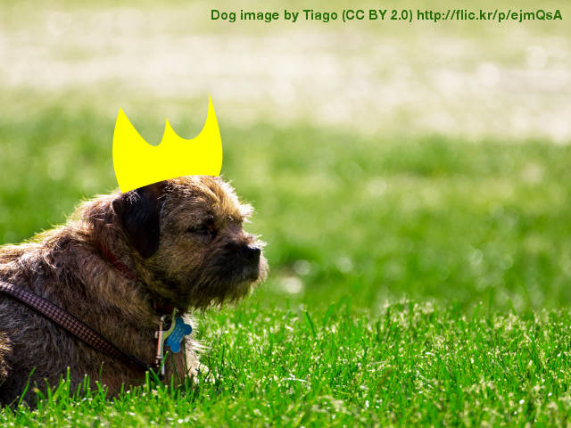
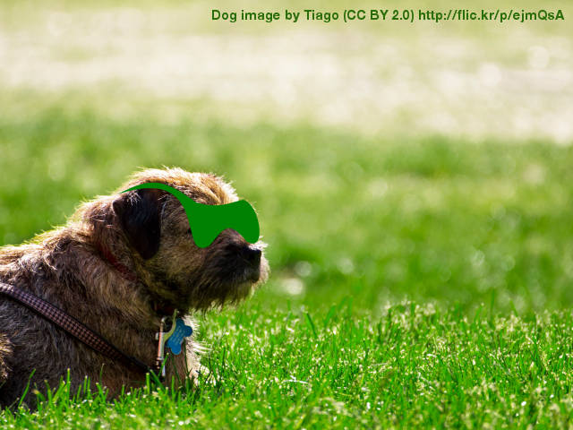
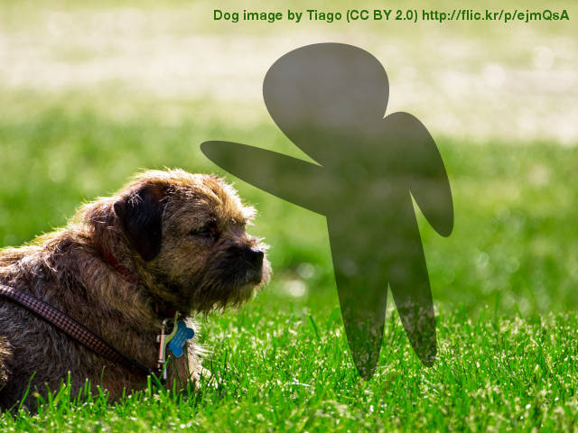
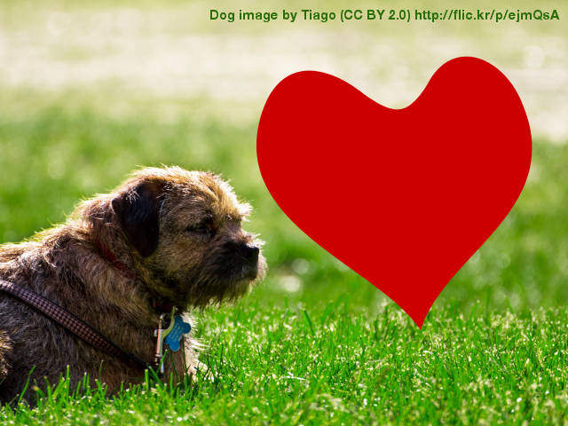

# FaceBuzz: Fun with Blobs on Photos

## Credits

- **Author**: Gauden Galea, 2013
- **GUI**: includes GUI classes by Mick Grierson, Matthew Yee-King, Marco Gillies, 2013
- **License**: MIT License (see LICENSE)
- **Image**: includes an image by Tiago (CC BY 2.0) [http://flic.kr/p/ejmQsA](http://flic.kr/p/ejmQsA)
- **PDF**: A PDF version of this document is [available here](./docs/README.pdf).

## Summary

This application was produced as an assignment for the Coursera course on ["Creative Programming for Digital Media & Mobile Apps"](https://class.coursera.org/digitalmedia-001/class/index) by Marco Gillies, Matthew Yee-King, Mick Grierson. It is packaged as a [Processing](http://processing.org) sketch that originally was intended to allow the user to reshape a vector blob into a moustache on a photo, but turned into a simple artistic toy. It illustrates a basic Graphical User Interface (GUI) application written in Processing. The result allows for an intriguing amount of creativity, and possibly, mischief. (See the Gallery at the very end of this document)


## The Menu

On running the sketch, we find a 640 by 480 pixel window with a picture of a dog. This is the home screen, with a row of buttons in a palette at the bottom. In the centre of the window is the outline of the vector that we will be editing; it is currently a pale, translucent yellow, circular path. Clicking on the buttons in the palette, will have the following effects, from left to right:

1. Turn off the fill; the outline remains as a stroke with 4 pixel thickness.
2. Turn on the fill; the path becomes a solid object.
3. Toggle transparency on and off.
4. Set the colour to red. This colour is globally set and will apply to both fill and outline.
5. Set fill and/or stroke colour to green.
6. Set fill and/or stroke colour to yellow.
7. Set fill and/or stroke colour to blue.
8. Set fill and/or stroke colour to white.
9. Set fill and/or stroke colour to black.
10. The button on the far right of the palette saves a snapshot of the current picture. The file is saved in the data directory of the sketch as a JPEG image. The file name is constructed from the year-month-day-hour-minute-second-millisecond of the instant of saving. 

## Re-shaping the Blob

If we click outside the menu area, the palette of buttons disappears, and a series of red and blue handles appear around the blob. At this point, the following actions are open to us:

- Dragging the blue handles changes the curves in between red points.
- Dragging red points changes the connection angle between two curves.
- Dragging anywhere on the screen alters the position of the whole blob.
- A single click without any drag, hides the handles and brings up the menu again.

It is probably easier to click and drag and see what happens, as it is easier to understand by playing with it.



## TODO and Further Notes

1. There is currently no means of setting stroke and fill colours independently, nor of deciding the saved filename. This needs to change if the user is to have a pleasant experience with the toy.
2. The base image may be changed by tinkering directly with the  code. First insert a 640 by 480 pixel image into the data directory of the sketch. Then edit the line that says `String INPUT_IMAGE = "dog.png";` at the head of `facebuzz.pde`, replacing `dog.png` with the filename of the new image.
3. The current version does not work under JavaScript and hence will only run under Processing in Java mode. For some reason the menu buttons do not appear, even if the application seems to compile under JavaScript and the blob may be re-shaped.
4. Testing under iOS (iPad only tested) -- the blob appears to jump around initially when the user starts dragging it. There seems to be a different interpretation of the coordinates on the JavaScript/iOS version than in the Java mode. This needs further investigation.
5. Of course, it would be ideal to be able to upload the resulting image to a FaceBook page or to Twitter as well as to add text and other blobs to the image. While these are desirable (any number of additional features are desirable), this application has achieved its aim: it demonstrates a fairly complex set of GUI interactions and establishes a code base that is "easily" extended to add other image manipulations. 
6. The Annex provides another Processing sketch that can be run separately from FaceBuzz. Its sole purpose is to create the buttons that are used in the main application. Creating thew buttons in code gives them neatness, consistency, and makes wholesale modifications much more convenient.
7. The original idea of the app was to draw moustaches onto pictures of people, hence the blob class in the code is called `mustache`. This was not an adoption of the American English form of the word, but a (silly) pun on _must ache_ as in coding a GUI seems easy but must always come with a lot pain... 


## Annex 1

### FaceBuzz Button Creator

Save the following code as a standalone sketch. Running it creates the buttons used in the FaceBuzz tools palette. The button images will be found in the data directory of the Button Creator sketch.

```
// button creator

PGraphics pg; 
String name;

void setup() {
  size( 36, 36 );
  pg = createGraphics(36,36);
}

void draw() {
  fill_icon();
  saver("./data/icon_fill.png");
  
  stroke_icon();
  saver("./data/icon_stroke.png");
  
  swatch(color(2,2,2));
  saver("./data/icon_swatch_black.png");
  
  swatch(color(255,255,255));
  saver("./data/icon_swatch_white.png");
  
  swatch(color(204,0,0));
  saver("./data/icon_swatch_red.png");
  
  swatch(color(0, 128,0));
  saver("./data/icon_swatch_green.png");
  
  swatch(color(0, 0, 255));
  saver("./data/icon_swatch_blue.png");
  
  swatch(color(255, 255, 0));
  saver("./data/icon_swatch_yellow.png");
  
  transparency();
  saver("./data/icon_swatch_transparent.png");
  
  downloader();
  saver("./data/icon_discsave.png", 4, 2, 28, 28);
}

void saver(String name) {
  background( 0,0,0,255 );
  image(pg, 0, 0);
  save(name);
}

void saver(String name, int x, int y, int w, int h) {
  background( 0,0,0,255 );
  image(pg, x, y, w, h);
  save(name);
}

void swatch(color c) {
  pg.beginDraw();
  pg.background( 0,0,0,255 );
  pg.smooth();
  pg.strokeWeight(4);
  pg.stroke(255);
  pg.fill(c);
  pg.rect(8, 8, 19, 19);
  pg.endDraw();
}

void downloader() {
  pg.beginDraw();
  pg.background( 0,0,0,255 );
  pg.smooth();
  pg.strokeWeight(4);
  pg.line(6,30, 30, 30);
  pg.strokeWeight(1);
  pg.stroke(0);
  pg.fill(255);
  pg.beginShape();
  pg.vertex(12, 6);
  pg.vertex(24, 6);
  pg.vertex(24, 18);
  pg.vertex(30, 18);
  pg.vertex(18, 30);
  pg.vertex(6, 18);
  pg.vertex(12, 18);
  pg.endShape(CLOSE);  
  pg.endDraw();
}

void transparency() {
  pg.beginDraw();
  pg.background( 0,0,0,255 );
  pg.smooth();
  pg.strokeWeight(1);
  pg.stroke(255);
  pg.fill(255,255,255,128);
  pg.rect(8, 8, 15, 15);
  pg.fill(0,0,0,128);
  pg.rect(13, 13, 15, 15);
  pg.endDraw();
}

void stroke_icon() {
  pg.beginDraw();
  pg.background( 0,0,0,255 );
  pg.smooth();
  pg.strokeWeight(4);
  pg.stroke(255);
  pg.noFill();
  pg.ellipse(width*0.5, height*0.5, 20, 20);
  pg.endDraw();
}

void fill_icon() {
  pg.beginDraw();
  pg.background( 0,0,0,255 );
  pg.smooth();
  pg.strokeWeight(2);
  pg.stroke(255);
  pg.fill(255);
  pg.ellipse(width*0.5, height*0.5, 20, 20);
  pg.endDraw();
}
```

## Annex 2

### A Gallery of Results

Despite the fact that there are only fifteen handles on the blob (5 red point connectors, and ten blue curve controllers), a surprising number of shapes can be created. This gallery illustrates the range, limited only by one's imagination:

- Dog with Bow-tie
- The Royal Dog
- The World through Green-tinted Glasses
- Ghostly Owner
- Dreams of Bones to Come
- Dogged by Romance











